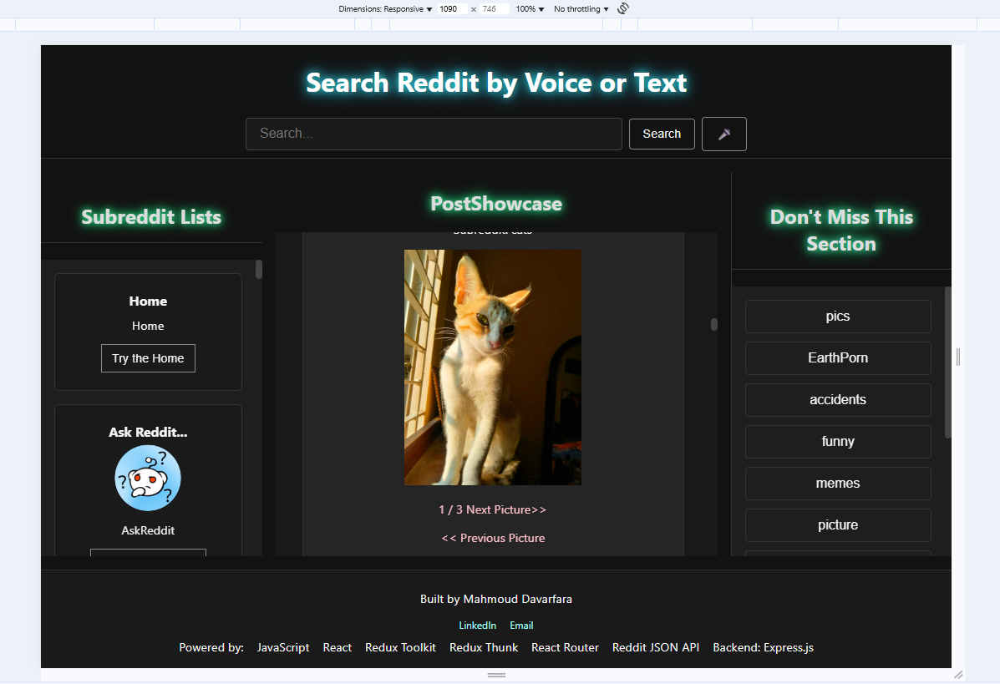
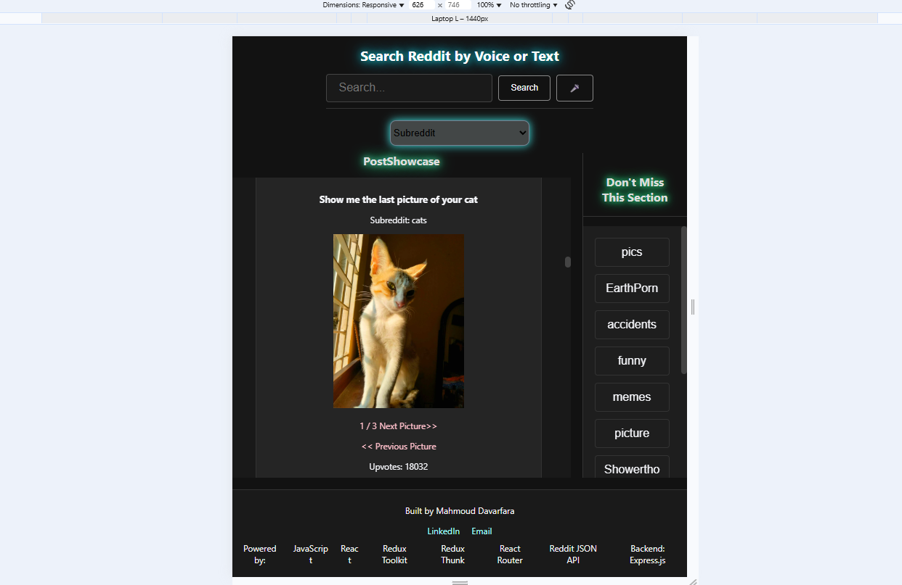

📌 Reddit Explorer App
A full-stack Reddit client built with React, Redux Toolkit, and Express.js.
It allows users to search Reddit posts by text or voice, browse trending topics, view subreddit lists, and fetch comments — all via the Reddit JSON API (proxied through an Express backend).

## 🚀 Demo
Watch the full demo on YouTube: [Reddit-Ap  Demo]:(https://youtu.be/EwLeTQ93hUA)
🌐 Live Site:https://reddit-client-mah.netlify.app/
--------

## 📷 Screenshots

## Lighthouse Performance

This project scores highly in performance, accessibility, and SEO.

[📄 View the Lighthouse Report for desktop](./lighthouse/lighthouse-report-desktop2025-08-10.html)
[📄 View the Lighthouse Report for mobail](./lighthouse/lighthouse-report-mobail2025-08-10.html)

🚀 Features
🔍 Search
Text Search – Enter a query to fetch matching Reddit posts.

Voice Search – Works on browsers that support SpeechRecognition (e.g., Chrome).

Input is sanitized to prevent XSS attacks.

📂 Browsing
Trending Sidebar – Curated list of trending subreddit topics (click to load posts).

Subreddit List – Displays popular subreddits on startup.

Large screens: Sidebar cards with title, icon, and "Try" button.

Small screens: Dropdown menu for selection.

📰 Post Showcase
Displays posts with:

Images, videos, and galleries (click to cycle gallery images).

Upvote count.

Comment count and "Get All Comments" button.

Fetch and cycle through comments for a selected post.

⚙ Backend Proxy
Avoids CORS issues and hides Reddit API credentials.

Endpoints:
/api/search?q=<query> – Search Reddit posts.

/api/comments/:postId – Get comments for a post.

/api/subredditlists/popular – Get popular subreddit lists.

🛠 Tech Stack
Frontend

React

Redux Toolkit & Redux Thunk

React Router

Axios

CSS Grid/Flexbox for responsive layout

Jest + React Testing Library for unit testing

Backend
Node.js + Express

Axios (for Reddit API requests)

CORS middleware
dotenv (environment variables)

API
Reddit OAuth API (Client Credentials Flow)

📂 Project Structure
css
Copy
Edit
root/
├── App.jsx
├── main.jsx
├── store.js
├── server.js
├── src/
│   ├── components/
│   │   ├── AppLayout.jsx
│   │   ├── VoiceSearchBar.jsx
│   │   ├── SubredditList.jsx
│   │   ├── TrendingSidebar.jsx
│   │   ├── PostShowcase.jsx
│   │   └── Footer.jsx
│   ├── features/
│   │   ├── postsSlice.js
│   │   ├── commentsSlice.js
│   │   └── subredditlistsSlice.js
│   ├── tests/
│   │   ├── App.test.jsx
│   │   ├── VoiceSearchBar.test.jsx
│   │   ├── postShowcase.test.jsx
│   │   ├── postShowcase.status-gate.test.jsx
│   │   └── postShowcase.comments.test.jsx
└── package.json

⚙ Installation & Setup

1️⃣ Clone the Repository
git clone https://github.com/mah-davarfa/reddit-client.git
cd reddit-explorer

2️⃣ Install Dependencies
npm install

3️⃣ Backend Setup
Create a Reddit OAuth application at https://www.reddit.com/prefs/apps

Set the redirect URI to http://localhost:3000

Create a .env file in the root with:
REDDIT_CLIENT_ID=your-client-id
REDDIT_CLIENT_SECRET=your-client-secret
Start the backend:

node server.js
4️⃣ Frontend Setup
npm run dev
App will run at: http://localhost:5173

🧪 Running Tests
npm test
Unit tests cover components like PostShowcase, VoiceSearchBar, and Redux slices.

Includes mock Axios calls for isolated testing.

🌐 Deployment
Frontend: Deploy to Netlify or Vercel
Backend: Deploy to Render.

Update baseUrl in slices to match your deployed backend URL.

📸 Screenshots
Voice Search	Post Showcase	Subreddit List
🎤 Search bar with mic	Images, videos, galleries	Popular subreddit cards

👤 Author
Mahmoud Davarfara
📧 Mah.Davarfa@gmail.com
🔗 LinkedIn

📜 License
This project is licensed under the MIT License.